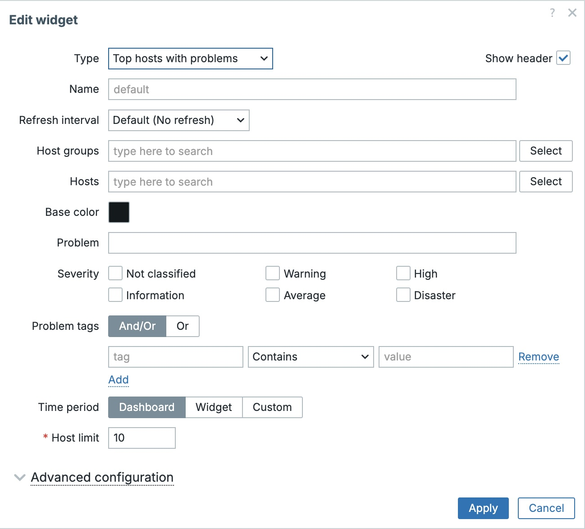

# Top Hosts with Problems

A Zabbix 7.4 dashboard widget that displays the hosts with the most problems within a configurable time period.



## Features

- Rank hosts by the number of problems in the selected time period
- Respect dashboard time period or use a widget-specific/custom time period
- Filter by host groups, hosts, problem name, severities, and problem tags
- Configurable host limit (top N)
- Clickable host names that open the Problems view filtered by the selected host
- Base color and optional thresholds for coloring the problem count

## Requirements

- Zabbix 7.4 or newer

## Installation

1. Copy the `top_hosts_with_problems` directory to the Zabbix frontend modules directory:

   ```bash
   cp -r top_hosts_with_problems /usr/share/zabbix/ui/modules/
   ```

   Adjust the destination path if your Zabbix frontend is installed elsewhere (for example, `/var/www/html/zabbix/ui/modules/`).

2. Open the Zabbix frontend and go to **Administration → General → Modules**.

3. Click **Scan directory**.

4. Find **Top hosts with problems** in the module list and click the **Disabled** link to enable it.

5. Open any dashboard, switch to edit mode, and add the **Top hosts with problems** widget.

## Configuration

The widget provides the following configuration fields:

| Field | Description |
|-------|-------------|
| **Host groups** | Show only hosts that belong to the selected host groups. |
| **Hosts** | Show only the selected hosts. |
| **Problem** | Filter problems by name (substring match). |
| **Severity** | Show only problems with the selected severities. |
| **Problem tags** | Add tag-based filters. Use **And/Or** or **Or** evaluation. |
| **Time period** | Use the dashboard time period, another widget, or a custom range. |
| **Host limit** | Maximum number of hosts to display (default: 10). |
| **Base color** | Default color used for the problem count. |
| **Thresholds** | Optional thresholds that override the base color when the problem count reaches the configured value. |

## How it works

The widget counts trigger problem events that occurred within the selected time period, aggregates them per host, and displays the hosts with the highest problem count.

## File structure

```
top_hosts_with_problems/
├── manifest.json              # Module metadata
├── Widget.php                 # Widget class (default name)
├── includes/
│   └── WidgetForm.php         # Configuration form fields
├── actions/
│   └── WidgetView.php         # Data retrieval and processing
├── views/
│   ├── widget.view.php        # Widget rendering
│   └── widget.edit.php        # Configuration form rendering
└── assets/
    ├── js/
    │   └── class.widget.js    # Frontend widget class
    └── css/
        └── widget.css         # Widget styles
```

## Uninstallation

1. Disable the module in **Administration → General → Modules**.
2. Remove the module directory:

   ```bash
   rm -rf /usr/share/zabbix/ui/modules/top_hosts_with_problems
   ```

## Troubleshooting

- **The widget does not appear in the dashboard widget list:** Make sure the module is enabled in **Administration → General → Modules** after copying the files.
- **"No data found" is shown:** Verify that the selected time period contains problem events and that the filters are not too restrictive.
- **Permission issues:** Ensure the web server user can read the files in `/usr/share/zabbix/ui/modules/top_hosts_with_problems/`.

## Compatibility

This widget follows the [Zabbix 7.4 widget module tutorial](https://www.zabbix.com/documentation/current/en/devel/modules/tutorials/widget) and uses the standard Zabbix widget API.
